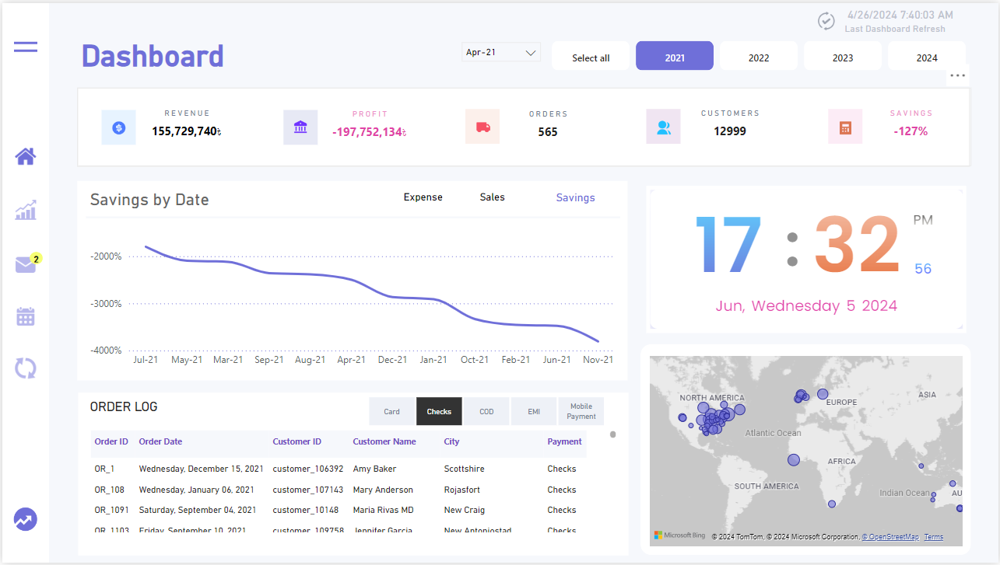
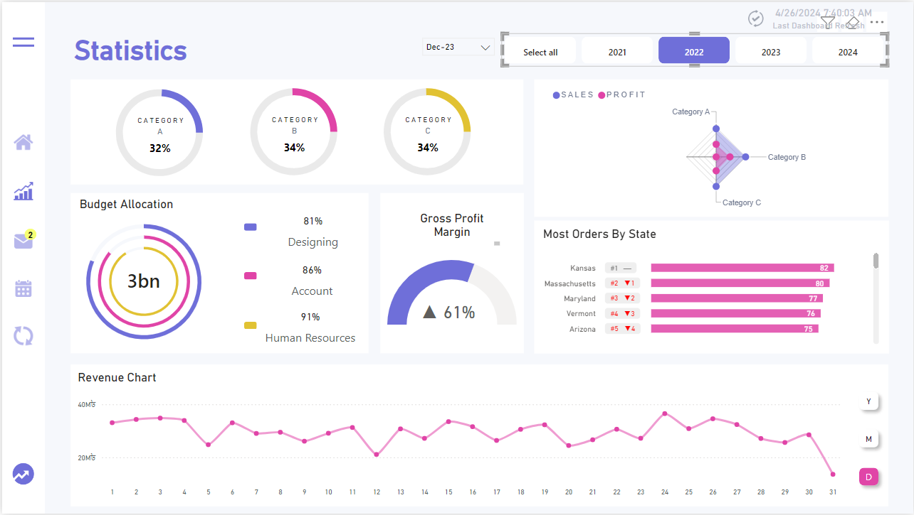
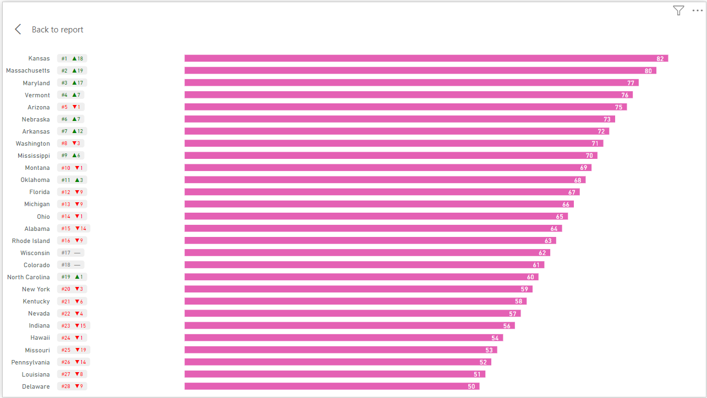
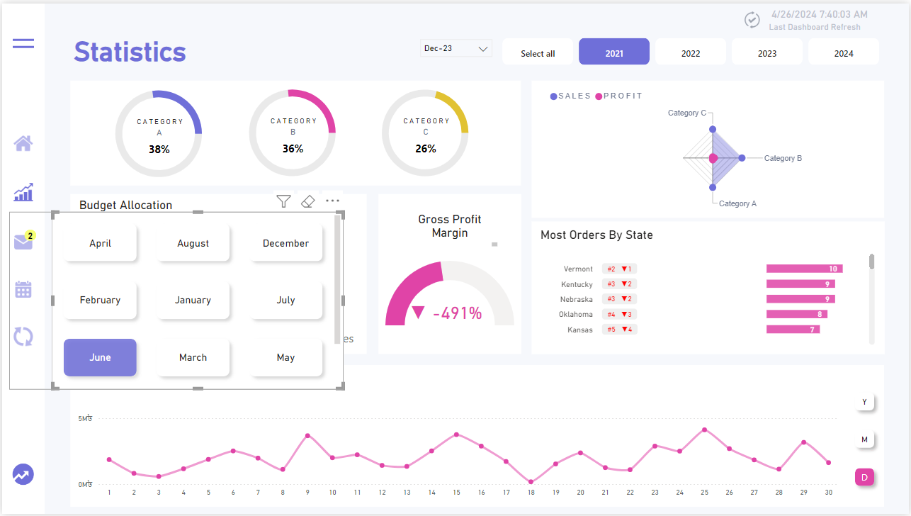
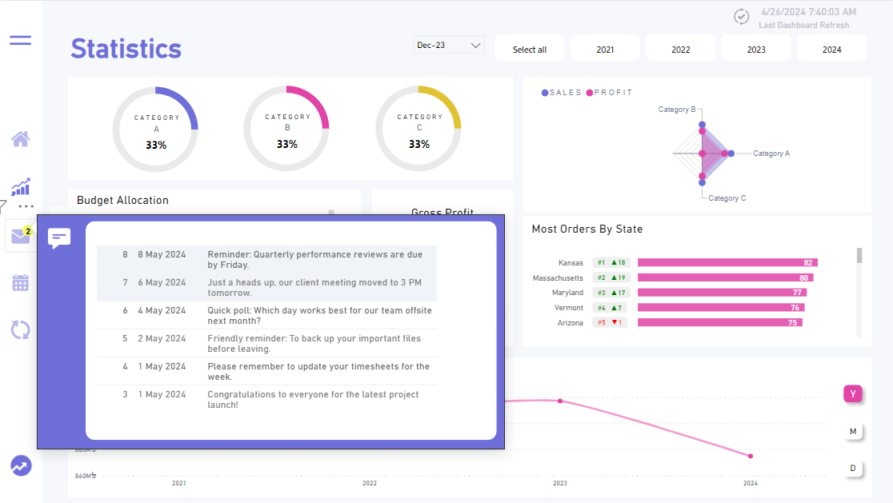

# Business Intelligence Dashboard

[Visual Representation (If Power BI account available)](https://app.powerbi.com/groups/me/reports/c57f1b7a-bceb-4e9f-bc41-732bb1fb8cf1/ReportSection?experience=power-bi)

## 📈 Overview

This project presents a comprehensive Business Intelligence (BI) dashboard developed in Power BI, designed to provide actionable insights into sales, revenue, profit, customer behavior, and organizational performance. The dashboard utilizes Data Analysis Expressions (DAX) for dynamic and interactive data visualizations, making it a powerful tool for decision-making.

The dashboard is divided into the following sections:
1. **Navigation Bar**: Date filters and data refresh details.
2. **Sidebar**: Navigation between modules and notification alerts.
3. **Dashboard**: Key Performance Indicators (KPIs), interactive charts, and geographic visualizations.
4. **Statistics Module**: In-depth analysis of categories, budget allocations, profit margins, and state-wise order rankings.

## 🚀 Features & Functionalities

### 1. Navigation Bar
- **Last Dashboard Refresh**: Displays the most recent refresh timestamp, powered by `DateTime.LocalNow()`.
- **Date Selection**: Users can filter data based on year and month for customized analysis.

### 2. Sidebar
- **Module Navigation**: Provides seamless access to different parts of the dashboard.
- **Notifications Panel**: Highlights recent activities, including performance reviews, reminders, and updates, with a tooltip for quick insights.

### 3. Dashboard
- **Key Metrix**:
  - **Revenue**: Aggregates total revenue with the DAX formula.
  - **Profit**: Computes profit as Total Sales - Total Expenses.
  - **Orders**: Displays the number of unique orders.
  - **Customers**: Counts the total number of unique customers.
  - **Savings**.
- **Dynamic Charts**:
  - **Sales, Expenses, and Savings Trends**: Displays percentage changes over time using a custom selection table (Line_Selection_Table).
  - **Global Map Visualization**: Highlights geographic customer distribution.
- **Real-Time Clock**:
  - Integrates a live clock and calendar using custom HTML and CSS, displaying the current time, date, and day of the week.

### 4. Statistics Module
- **Category Analysis**:
  - Displays product breakdown by categories (A, B, C) and their contribution percentages to the total sales.
- **Radar Chart**:
  - Compares category-wise performance across sales and profit.
- **Budget Allocation**:
  - Visualizes department-wise budget utilization and allocation targets.
- **Gross Profit Margin**:
  - Displays KPIs with directional indicators (▲ for growth, ▼ for decline).
- **Order Rankings by State**:
  - Ranks states based on the number of orders, with year-over-year comparisons and trend indicators.

## 📊 Dataset Overview

The dashboard uses a structured dataset with the following primary tables:
1. **Sales Table**: Contains details about sales transactions, including revenue, category, and product data.
2. **Products Table**: Includes product pricing and stock information.
3. **Orders Table**: Tracks order information, including customer IDs and order dates.
4. **Customer T**: Stores customer demographic details such as location, contact information, and total purchases.
5. **Department Table**: Details budget allocations for various departments.
6. **Notifications Table**: Logs notifications and reminders for dashboard users.
7. **Line Selection Table**: A custom table for selecting and visualizing different metrics dynamically.

## 📈 Visualizations

### Dashboard
- Real-time KPIs for revenue, profit, and savings.
- Geographic map of customer orders.
- Order log for detailed transaction history.

### Statistics Module
- Dynamic radar chart for category performance.
- Budget allocation insights with percentage breakdowns.
- Historical trends in revenue, expenses, and savings.

### Ranking
- Covers a range of states and their rankings along with changes.

### Sales and Profit Statistics Dashboard
- Category Distribution.
- Most Orders by State.
- Gross Profit Margin.
- Budget Allocation.
- Performance Trends.

### Notifications
- Recent updates and alerts in a user-friendly panel.

## 📝 Requirements
- **Power BI Desktop** for dashboard development and interaction.
- **DAX Expertise**: For formula customizations and advanced data modeling.
- A relational dataset including tables like Sales, Products, Orders, Customer, and more.

## 🔧 Setup Instructions
1. Load the dataset into Power BI Desktop.
2. Refresh the data model to update KPIs and visualizations.
3. Use the sidebar to navigate across modules.
4. Leverage filters and slicers for customized reporting.

## 🔜 Future Enhancements
- Integration with live data sources for real-time updates.
- Drill-through pages for deeper insights.
- Export functionality for KPI reports.

## 👨‍💻 Author

[![LinkedIn][github-shield]][github-url]
[![LinkedIn][linkedin-shield]][linkedin-url]

[github-shield]: https://img.shields.io/badge/-GitHub-black.svg?style=flat-square&logo=github&color=555&logoColor=white
[github-url]: https://github.com/Limon00001
[linkedin-shield]: https://img.shields.io/badge/-LinkedIn-black.svg?style=flat-square&logo=linkedin&colorB=555
[linkedin-url]: https://www.linkedin.com/in/monayem-hossain-limon/
